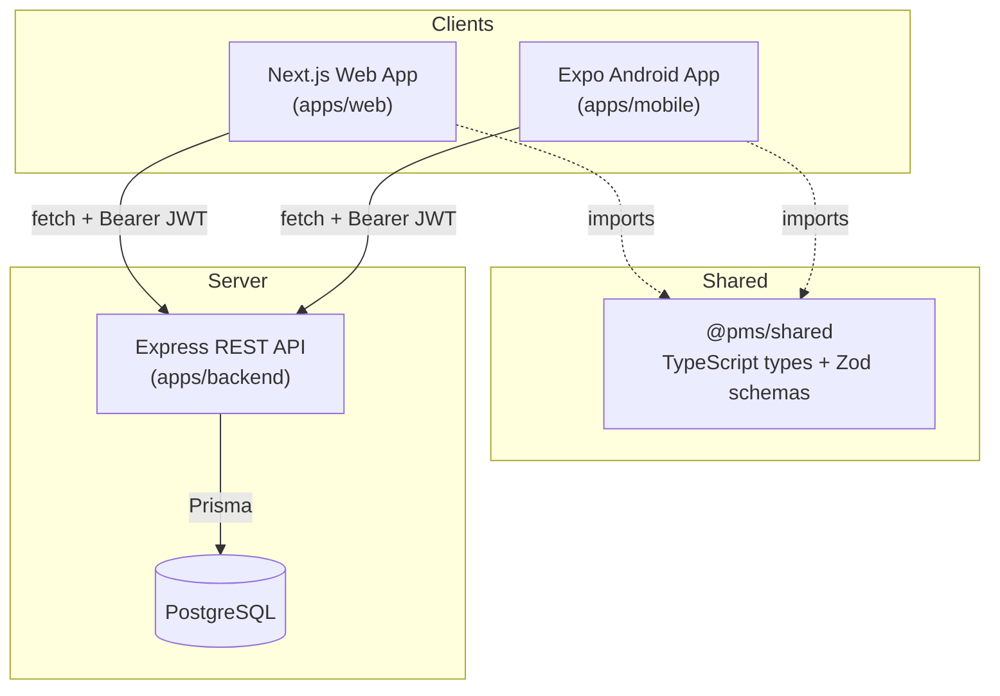

# Architecture

## Overview

A single Express/PostgreSQL backend is shared by two independent clients — a Next.js web app
and an Expo (React Native) Android app. Both clients talk to the exact same REST API, the same
database, and the same JWT-based auth system, so a user registered on one platform can log in
on the other immediately with no sync step.



## Monorepo layout

```
/apps
  /web       Next.js 14 (App Router) + TypeScript + Tailwind
  /mobile    Expo (React Native) + Expo Router + React Native Paper
  /backend   Express + TypeScript + Prisma + PostgreSQL
/packages
  /shared    TypeScript types + Zod validation schemas used by both web and mobile
/docs        Architecture, API, security, ER diagram, assessment checklist
```

Managed as a pnpm workspace (`pnpm-workspace.yaml`); `@pms/shared` is a `workspace:*` dependency
of both `@pms/web` and `@pms/mobile`, so a Zod schema or type change is picked up by both
clients the moment it's edited — there is no copy-pasted validation logic between them.

## Why this stack

- **Express + Prisma + PostgreSQL** — a REST API with a strongly-typed ORM and a real
  relational database were explicit requirements. Prisma gives compile-time-checked queries and
  migrations without hand-written SQL, which also closes off SQL-injection risk by construction
  (see `docs/SECURITY.md`).
- **Next.js (App Router) for web** — file-based routing matches the required page structure
  (`/login`, `/dashboard`, `/projects`, `/projects/[id]`, …) almost 1:1, server/client component
  split keeps the bundle lean, and the production build is static-optimized where possible.
- **Expo + Expo Router for mobile** — Expo Router gives the same file-based routing model as
  Next.js (so the two codebases feel consistent to a developer moving between them), while
  `expo-secure-store` provides the OS-level encrypted storage the assignment requires for the
  JWT (Keychain on iOS, Keystore-backed EncryptedSharedPreferences on Android).
- **TanStack Query on both clients** — handles loading/error/retry state and cache invalidation
  after mutations uniformly, so a task update on mobile and on web both result in the dashboard
  and list views refetching fresh data rather than trusting stale local state.
- **React Hook Form + Zod on both clients** — the exact same validation rules
  (`packages/shared/src/schemas.ts`) run client-side for instant feedback and server-side
  (`apps/backend/src/schemas/*.ts`) as the actual security boundary — client validation is a UX
  nicety, never trusted on its own.

## Request lifecycle (web/mobile → backend)

1. Client calls `apiFetch()` (one implementation per client, functionally identical), which
   attaches `Authorization: Bearer <token>` from `localStorage` (web) or `expo-secure-store`
   (mobile).
2. Express middleware chain: `helmet` → `cors` → `express.json` → `pino-http` request logger →
   rate limiter → route-specific `requireAuth` → Zod `validateBody/Query/Params` → handler.
3. Handler queries Prisma scoped by `where: { userId: req.userId }` (or checks
   `project.userId === req.userId` before mutating) — this is the ownership boundary described
   in `docs/SECURITY.md`.
4. Centralized `errorHandler` middleware turns `ApiError`, `ZodError`, and known Prisma errors
   into consistent `{ error: { message, details } }` JSON with the right status code; anything
   unexpected becomes a logged `500` with no stack trace leaked in production.
5. On the client, a `401` response clears the stored token and triggers the shared
   "session expired" flow (toast + redirect to `/login` on web, a dismissible banner + redirect
   on mobile) rather than a silent failure or crash.

## Data flow for the cross-platform demo

Because both clients hit the same `/api/projects` and `/api/tasks` endpoints against the same
database, a task created on web is immediately visible to mobile's next fetch (triggered by
pull-to-refresh or TanStack Query's automatic invalidation after a mutation) — there is no
polling, push, or sync layer to build or debug; the "sync" is just two clients reading the same
source of truth.
