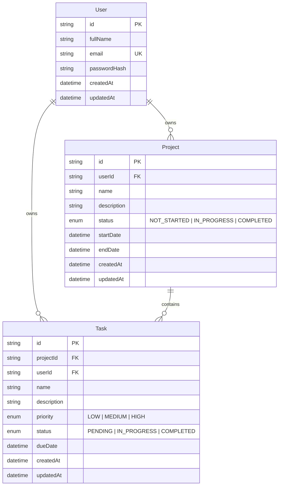

# Entity-Relationship Diagram

The system uses three core tables — `User`, `Project`, and `Task` — with enforced foreign keys,
cascading deletes, and indexes on every column used for filtering or ownership checks.

## Design notes

- **Primary keys**: UUIDs (`@default(uuid())`), avoiding sequential-id enumeration attacks.
- **`User.email`** has a unique constraint and a supporting index — enforced at the database
  level, not just in application code, so a race condition can never create two accounts with
  the same email.
- **`Project.userId`** and **`Task.userId` / `Task.projectId`** are foreign keys with
  `onDelete: Cascade` — deleting a user deletes their projects and tasks; deleting a project
  deletes its tasks. There is never an orphaned row.
- **`Task.userId`** is denormalized (duplicated from `Task.projectId → Project.userId`)
  deliberately, as suggested by the assignment, so that ownership checks and the dashboard's
  aggregate counts can filter directly on `Task.userId` without an extra join — this keeps the
  dashboard query a single indexed scan per statistic instead of a join + scan.
- **Indexes**: `[userId]`, `[userId, status]`, `[userId, name]` on `Project`; `[projectId]`,
  `[userId]`, `[userId, status]`, `[userId, priority]`, `[projectId, status]` on `Task`. These
  match the exact filter combinations used by `GET /api/projects` and `GET /api/tasks`
  (search, status filter, priority filter, project filter — all scoped by the authenticated
  user).
- **Timestamps**: every table has `createdAt` (set once) and `updatedAt` (auto-maintained by
  Prisma's `@updatedAt`), satisfying the "Created Date" field required for both Projects and
  Tasks.

See [`apps/backend/prisma/schema.prisma`](../apps/backend/prisma/schema.prisma) for the
authoritative Prisma schema this diagram is generated from.
